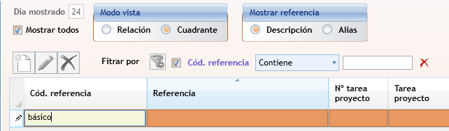
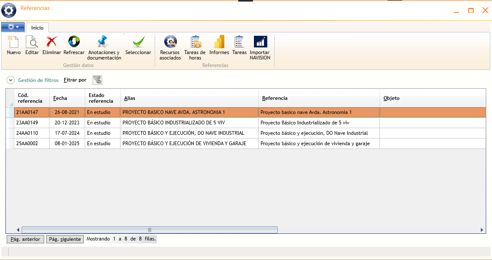

# Búsqueda de valores en campos

---

<aside class="doc-sidebar">
  
En esta página

  <ul>
    <li><a href="#Uso">Uso</a></li>
    <li><a href="#ejemplo">Ejemplo</a></li>
  </ul>
  
Relacionado

  <ul>
    <li><a href="UsoGeneral.html">Uso general</a></li>
  </ul>
</aside>

## Uso

Cuando un campo requiere elegir un valor de una tabla (un tercero, un proyecto, un tipo de documento…), aparece `<F4> buscar` cuando no tiene un valor asignado, que indica que es posible realizar una búsqueda. Para ello, deben seguirse estos pasos:

1. Escribe parte del código o la descripción y pulsa `Tab`.
2. Alternativamente, pulsa `Alt`+`↓` o `F4` para abrir directamente ventana de búsqueda. Los datos quedarán filtrados de acuerdo con el texto introducido.
3. Selecciona el valor de la lista y confirma con `Intro` o el botón  `Seleccionar` que aparecerá en la cinta de opciones.

## Ejemplo

Cumplimentando un parte de horas, debemos localizar el código de una  referencia para imputar horas. Sabemos que se trata de una actuación tipo "Proyecto básico". Podemos escribir directamente "básico" en el campo de código de referencia, como palabra más significativa, y pulsamos &lt;tab&gt; para comenzar la búsqueda.

  

Seguidamente aparecerán las referencias que contengan o empiecen por el texto que hayamos escrito (tanto en el código de referencia, en su descripción o en el _alias_) y seleccionamos la que corresponda:

>En conclusión, podemos realizar búsquedas por la palabra o el texto que resulte más significativo en las descripciones, alias, códigos, ..., sin tenener que memorizar códigos.

---

[Arriba](#búsqueda-de-valores-en-campos)
