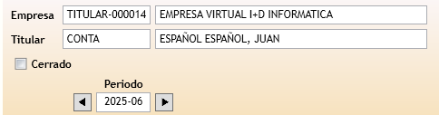
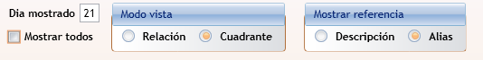
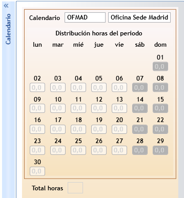
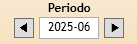
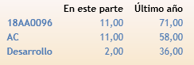

#  Manual usuario GTA - Parte de horas

---

← [Índice](../index.md) · [Módulos](../Modulos.md)

---

## ¿Qué es el parte de horas?

La ventana **Parte de horas** permite registrar las horas trabajadas por un empleado en un periodo mensual. Cada parte corresponde a un empleado y un mes concreto. Desde esta ventana se pueden consultar, introducir y modificar todas las imputaciones de horas del periodo.

---

## Cabecera

En la parte superior de la ventana se muestra la información del parte:

- **Empresa** y **Titular** — empresa y empleado al que pertenece el parte.
- **Cerrado** — casilla que indica si el parte está cerrado. Un parte cerrado no permite añadir, modificar ni eliminar líneas de detalle.
- **Periodo** — mes y año en formato `AAAA-MM`. Se puede cambiar con los botones de navegación (← periodo anterior / periodo siguiente →).

---

## Opciones de visualización

Son varias las opciones que se pueden utilizar para adaptar la visualización del detalle del parte:

### Mostrar todos

Al marcar esta opción se mostrará todo el detalle del parte, es decir, todas las horas introducidas en los días. Por el contrario, con la opción desmarcada, solo se mostrará el detalle de horas del día que figure en **Día mostrado**.

### Modo Vista

Estas 2 opciones afectan al formato aplicado al detalle del parte.

#### Modo Relación

Muestra cada imputación en una fila independiente. Cada fila contiene:

| Campo | Descripción |
| ------- | ------------- |
| Referencia | Proyecto o referencia al que se imputan las horas |
| Tarea proyecto | Subtarea o tarea dentro de la referencia |
| Tarea horas | Tipo de hora (ordinaria, guardia, etc.) |
| Día | Día del mes |
| Horas | Número de horas imputadas |
| Contrato CyP / Tarea CyP | Contrato y tarea de coste y presupuesto (si aplica) |

Las filas aparecen ordenadas por día. Si el filtro **Mostrar todos** está desactivado, solo se muestran las líneas del día seleccionado en el calendario.

#### Modo Cuadrante

Muestra una fila por cada combinación de referencia y tarea, con una columna para cada día del mes. Se introduce o modifica el número de horas directamente en la celda correspondiente al día.

- Si **Mostrar todos** está activado, se ven todas las columnas de días del mes.
- Si está desactivado, solo se muestra la columna del día seleccionado.
- Para eliminar todas las horas de una o varias filas, selecciónelas y use el botón **Eliminar** de la cinta.

> En modo cuadrante, los cambios se guardan al confirmar la edición de la fila. Las celdas con valor cero eliminan la línea de detalle correspondiente.

---

### Mostrar referencia

Permite la visualización, bien de la descripción de la referencia o proyecto, o bien del nombre corto (_alias_).

## El calendario

En el panel lateral se muestra el calendario del mes. Se puede contraer o expandir haciendo click en la banda de la izquierda.

Cada día aparece con un color que indica su tipo (laborable, festivo, fin de semana, etc.). Debajo del calendario se totalizarán las horas que contenga el parte.

Al hacer clic sobre un día:

- Se selecciona ese día como **Día mostrado**.
- Si **Mostrar todos** estaba activo, se desactiva automáticamente para mostrar solo ese día.

---

## Navegación entre periodos

Los botones **←** y **→** de la cabecera permiten moverse al mes anterior o siguiente sin cerrar la ventana.

> Si el parte del mes de destino no existe, la aplicación muestra un aviso y no realiza el cambio.

---

## Introducir horas

### En modo Relación

Aunque el parte no contenga horas, se mostrarán las referencias y tareas utilizadas en el parte anterior, reduciendo así el trabajo de volver a buscarlas.

1. En caso de que la referencia y tarea de proyecto donde se quieren imputar horas no aparezca, Pulsa el botón  **Nuevo** que aparece justo encima del detalle.
2. Seleccione o escriba la **Referencia**. Pulse `F2` o `↓` para abrir el buscador.
3. Rellene la **Tarea proyecto** y la **Tarea horas** de la misma forma.
4. Indique el **Día** y las **Horas**.
5. Confirme la línea con `Intro` o desplazándose a otra fila.

> Al añadir una nueva línea, el campo **Día** toma por defecto el día actualmente seleccionado en el calendario.

### En modo Cuadrante

1. Si la referencia y tarea que necesitas no aparecen en la lista, pulse **Nuevo** para añadir una fila.
2. Rellene la **Referencia** y la **Tarea**.
3. Escriba las horas en la celda del día correspondiente.
4. Confirme con `Intro` o pasando a otra celda.

---

## Cerrar / abrir el parte

La casilla **Cerrado** de la cabecera bloquea o desbloquea el parte:

- **Cerrar** un parte impide cualquier modificación posterior en el detalle.
- Si el parte no cumple las condiciones mínimas de horas, la aplicación mostrará un aviso e impedirá el cierre.
- Si se cierra con un número de horas inusualmente alto, se muestra una advertencia, pero el cierre se permite.
- Para **reabrir** un parte ya cerrado, desmarque la casilla (requiere los permisos adecuados).

> El sistema registra automáticamente el usuario y la fecha en que se cerró el parte.

---

## Estadísticas y totales

En la parte superior derecha de la ventana se muestra el desglose de horas de la referencia, tarea de proyecto y tarea de horas imputadas en el parte y en los últimos 12 meses.

---

## Avisos habituales

| Aviso | Causa |
| ------- | ------- |
| _"El parte de horas del periodo AAAA-MM no está creado"_ | El parte del mes al que se intenta navegar no existe todavía. |
| _"Termina antes la edición en curso"_ | Se intentó cambiar de modo, cerrar el parte o navegar de periodo mientras había una fila en edición. |
| _"Revisa la línea, has introducido horas el día X, que es [festivo/fin de semana]"_ | Se han guardado horas en un día no laborable según el calendario del empleado. El registro se guarda igualmente. |
| _"Ya existe una línea con la combinación de referencia / tarea proyecto / tarea horas"_ | En modo cuadrante, se intentó cambiar los datos identificativos de una fila a una combinación ya existente. Los cambios se cancelan. |

---

← [Índice](../index.md) · [Módulos](../Modulos.md)
