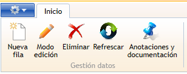
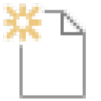
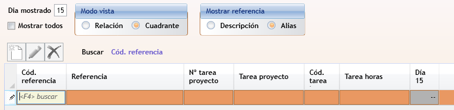

#  Manual usuario GTA - Uso general de la aplicación

---

← [Índice](index.md) · [Visión general](overview.md) · [La ventana principal](VentanaPrincipal.md) · [Filtrado de datos](FindByControl.md) →

---

## Ventanas

Aunque GTA tiene muchas pantallas, casi todas siguen el mismo esquema de dos pasos.

### Ventana de relación (lista)

Desde la cinta se abre una **ventana de relación**, que muestra una tabla con todos los registros del tipo seleccionado. Esta ventana permite:

- **Filtrar y buscar** con el control de búsqueda de la cabecera. Puedes combinar varios campos a la vez y guardar tus filtros para reutilizarlos en futuras sesiones.
- **Ordenar** pulsando en la cabecera de cualquier columna.
- **Seleccionar** uno o varios registros para operar sobre ellos (abrir, imprimir, exportar, etc.).
- **Editar** o **eliminar** los datos mostrados, o **añadir** nuevas filas.
    > No todas las  pantallas tienen habilitada la edición de los datos en la lista.

### Ventana de detalle (ficha)

Al hacer doble clic en una fila, o pulsar el botón correspondiente de la cinta de opciiones, se abre la **ventana de detalle** con el registro completo. Desde aquí puedes:

- Consultar y editar todos los campos.

    > Se debe utilizar la tecla `Tab` para navegar entre campo y campo.

- Navegar por las pestañas internas (líneas de detalle, documentos adjuntos, historial, etc.).
- Los cambios se guardan automáticamente, una vez _validados_, al salir de la caja de texto de edición del campo, o al salir de la ventana.
- Si los cambios realizados no pueden ser validados, aparecerán mensajes de validación debajo de la cinta de opciones.
    > Mientras no queden validados, los datos no se guardarán.
- Para salir de la ventana, basta con pulsar `Esc` o pinchar en el aspa de la esquina superior derecha de la ventana.

    ---

## Grupo «Gestión datos» de la cinta de opciones

La mayoría de ventanas incluyen en la cinta de opciones el grupo **Gestión datos**, que agrupa los botones de gestión de registros. Los botones visibles en cada momento dependen del tipo de ventana, del modo activo y de los permisos del usuario.

| Botón | Descripción |
| --- | --- |
|  **Nueva fila** | Añade una nueva fila directamente al final de la tabla de la ventana de relación. |
|  **Nuevo** | Crea un nuevo registro y lo abre en la ventana de detalle para cumplimentarlo. |
|  **Ver / Editar** | Abre el registro seleccionado en la ventana de detalle. El nombre del botón cambia según el modo activo y los permisos del usuario. |
| Modos **Ver / Editar lista** | Cambia la tabla de la ventana de relación al modo  **Ver (solo lectura)**: los datos no son editables directamente en la tabla, o  **Editar (edición en línea)**: los datos se pueden modificar directamente en la celda. |
|  **Eliminar** | Elimina el registro o fila seleccionados. Solicita confirmación antes de proceder. |
|  **Actualizar** | Recarga los datos desde la base de datos, reflejando los cambios más recientes. |
|  **Anotaciones** | Abre la ventana de anotaciones del registro activo: notas internas, comunicaciones, seguimiento, etc. |
|  **Seleccionar** | Visible únicamente cuando una ventana se abre en **modo búsqueda** (al pulsar `F4` o `Alt`+`↓` desde un campo de búsqueda). Confirma la selección del registro activo y cierra la ventana de búsqueda. |

---

## Búsqueda de valores en campos

Cuando un campo requiere elegir un valor de una tabla (un tercero, un proyecto, un tipo de documento…), el campo actúa como buscador:

1. Escribe parte del código o la descripción y pulsa `Tab`.
2. Alternativamente, pulsa `Alt`+`↓` o `F4` para abrir directamente ventana de búsqueda. Los datos quedarán filtrados de acuerdo con el texto introducido.
3. Selecciona el valor de la lista y confirma con `Intro` o el botón  `Seleccionar` que aparecerá en la cinta de opciones.

## Filtrado de datos

Consulta [Filtrado de datos](FindByControl.md) para una descripción detallada del control de filtros.

---

← [Índice](index.md) · [Visión general](overview.md) · [La ventana principal](VentanaPrincipal.md) · [Filtrado de datos](FindByControl.md) →
