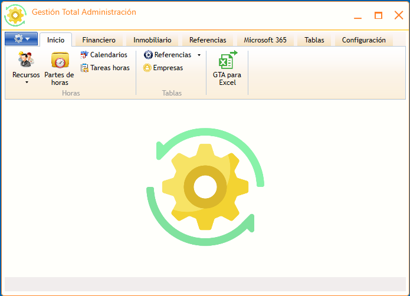

#  Manual usuario GTA - La ventana principal

---

← [Índice](index.md) · [Uso general →](UsoGeneral.md)

---

La ventana principal está organizada con una **cinta de opciones** en la parte superior, al estilo Microsoft Office. Cada pestaña agrupa las funciones de un área concreta.

---

Las pestañas disponibles son:

| Pestaña | Qué puedes hacer aquí |
| --- | --- |
|  **Inicio** | Titulares (empleados), partes de horas, tablas comunes y herramientas de Excel |
|  **Elementos** | Inventario de equipos e infraestructura, licencias Microsoft 365, lotes de facturación |
|  **Financiero** | Seguros, escrituras, información financiera, informes Navision y gestión Taxor |
|  **Inmobiliario** | Fincas catastrales y registrales, entidades inmobiliarias, contratos y escrituras |
|  **Referencias** | Proyectos, tareas, horas imputadas, certificaciones de obra y comparativos de compras |
|  **Microsoft 365** | Grupos, Planner, tareas To-Do y usuarios de la organización |
|  **Tablas** | Maestros de la aplicación: terceros, provincias, municipios, series, tipos, etc. |
|  **Configuración** | Usuarios, roles y permisos, ajustes de la aplicación y registros de auditoría |

> La cinta se adapta automáticamente a los permisos de cada usuario: las pestañas y botones a los que no tienes acceso no aparecen.

---

← [Índice](index.md) · [Uso general →](UsoGeneral.md)
